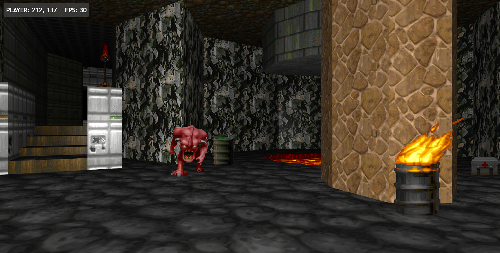

# FPS Experiment

A learning exercise in writing a simple retro style FPS like Doom using nothing by JavaScript and WebGL
A spin off repo from https://github.com/benc-uk/webgl-sandbox

## Screenshots




## Running Locally

Run a HTTP server from the root of this repo, and browse to the local URL

If you have Node installed, you can run:

```bash
make install-tools
make local-server
```