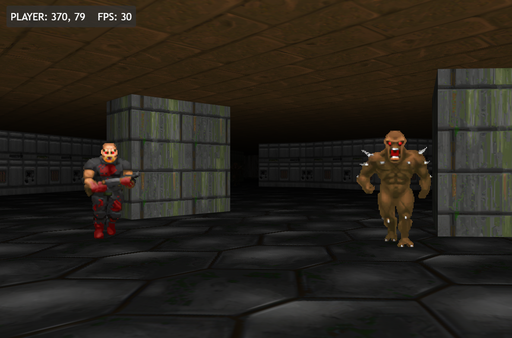
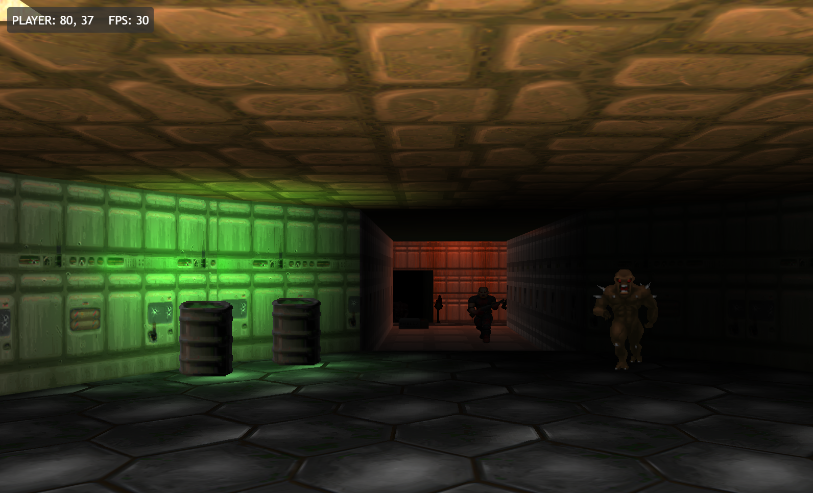
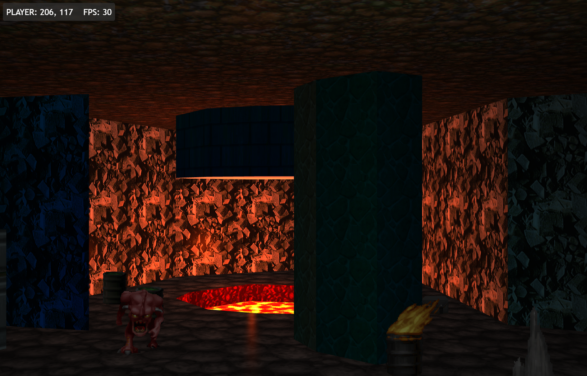

# 'Doom Like' FPS Experiment

A learning exercise in writing a simple retro style FPS like Doom using nothing by JavaScript and WebGL.  
A spin off repo from work originally created here https://github.com/benc-uk/webgl-sandbox

## Screenshots






## Running Locally

Run a HTTP server from the root of this repo, and browse to the local URL

If you have Node installed, you can run:

```bash
make install-tools
make local-server
```

## Controls

- **Move Forward** - W / up-arrow
- **Move Back** - S / down-arrow
- **Turn Right** - D / right-arrow
- **Turn Left** - A / left-arrow
- **Strafe Right** - Q
- **Strafe Left** - E
- **Look Up** - R
- **Look Down** - F

### Debug Controls

- **FOV decrease** - 1
- **FOV increase** - 2
- **NOCLIP toggle** - Insert
- **Move Up** - Page Up (when NOCLIP is enabled)
- **Move Down** - Page Down (when NOCLIP is enabled)

## Included Libraries

Some libraries have been copied into the repo (within the lib folder), this has been done under the terms of the license they have been distributed under.