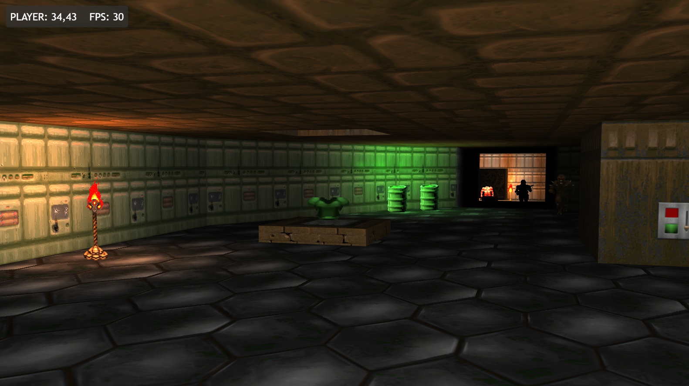
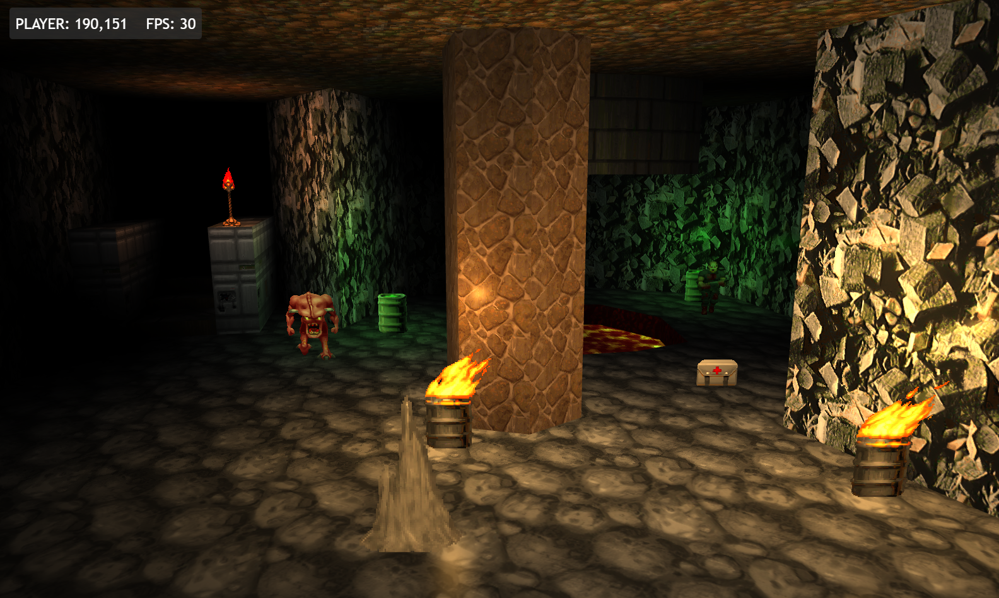
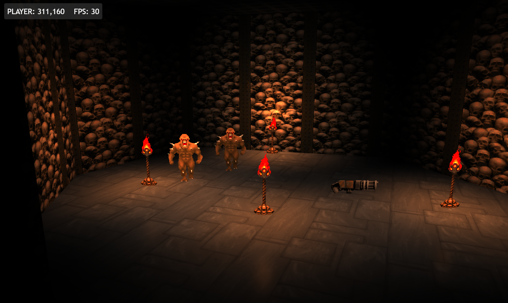
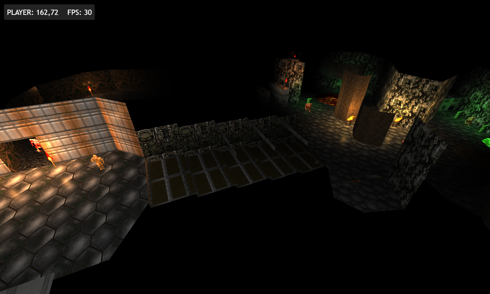

# 'Doom Like' FPS Engine

This repo is a learning exercise in writing a simple retro style FPS engine, similar to Doom using nothing by JavaScript and WebGL. 

It is not an attempt to implement the original Doom engine in JS, instead a fully polygon based 3D world is created & rendered using WebGL. The world (walls, floors, ceilings etc) consists of triangle meshes, and the items, monsters etc are draw using the 'bill-boarding' technique to inject 2D sprites into a 3D world.

Current features:

- 🧊 Full 3D geometry, including triangulated floors and ceilings
- 🗺️ Custom levels loaded from JSON
- 🖼️ Doom style texture mapping
- 🪚 Sectors with differing heights for floors & ceilings
- 🪨 Physics based collision detection 
- 🚨 Multiple lights and coloured lighting
- 🏃‍♂️ Animation for sprites

No bundling or compilation is required, it runs as a pure HTML & JS app, using modern ES6 modules.

## Live Demo

[Live demo version is here](http://code.benco.io/doom-lite/) hosted on GitHub pages

## Screenshots






## Running Locally

Run any [HTTP server of your choice](https://gist.github.com/benc-uk/3c4b00ce33432ade88914aee28737c4c#file-local-server-md) from the root directory of this repo, and browse to the URL serving this repo folder.

If you have Node installed, you can run:

```bash
make install-tools
make local-server
```

---

The makefile is your friend, simply run `make` for helpful text 

```text
$ make
 _          _       
| |__   ___| |_ __  
| '_ \ / _ \ | '_ \ 
| | | |  __/ | |_) |
|_| |_|\___|_| .__/ 
             |_|    
help                 💬 This help message :)
install-tools        🔮 Install dev tools into project bin directory
lint                 🌟 Lint & format check only, sets exit code on error
lint-fix             📝 Lint & format, attempts to fix errors & modify code
local-server         🌐 Start a local HTTP server for development
```

## Controls

- **Move Forward** - W / up-arrow
- **Move Back** - S / down-arrow
- **Turn Right** - D / right-arrow
- **Turn Left** - A / left-arrow
- **Strafe Right** - Q
- **Strafe Left** - E
- **Look Up** - R
- **Look Down** - F

### Debug Controls

- **FOV decrease** - 1
- **FOV increase** - 2
- **NOCLIP toggle** - Insert
- **Move Up** - Page Up (when NOCLIP is enabled)
- **Move Down** - Page Down (when NOCLIP is enabled)

## Included Libraries

Some libraries have been copied into the repo (within the lib folder), this has been done under the terms of the license they have been distributed under.